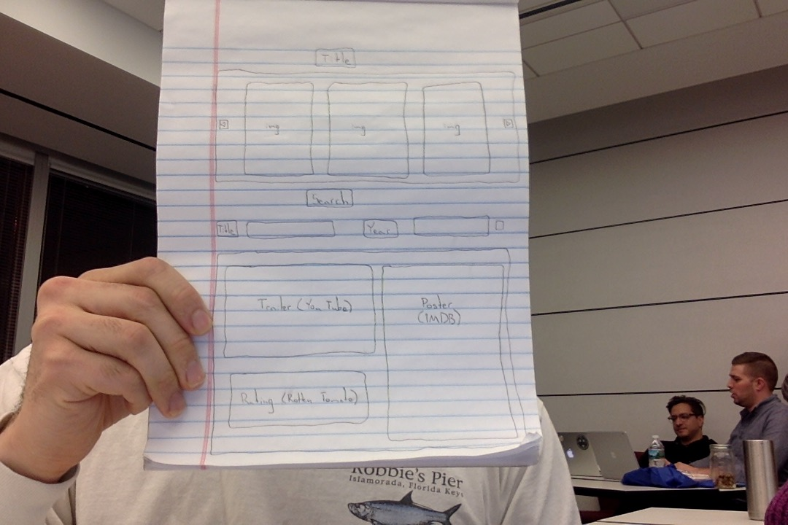
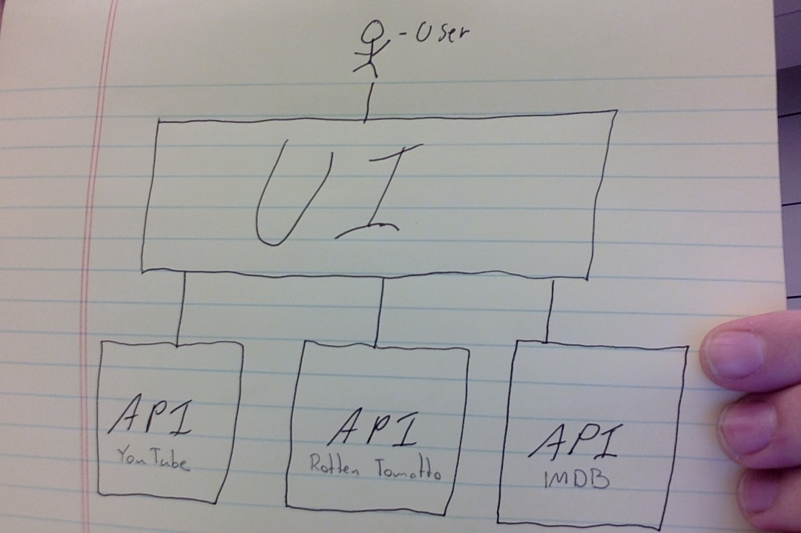

# Project Proposal

## Project Title: Trailer Park

## Team Frog

- Robert
- Keka
- Rich
- Jeremy

## Project Description:
An app that uses the user's search parameters to pull and display a trailer using the Youtube API and a rating using the Rotten Tomatoes API.

## UI Mockup

## Architecture

## APIs to be used:
- Youtube
- Rotten Tomatoes
- OMDB

## Breakdown of Tasks:

### Robert
- [ ] stuff

### Keka
- [ ] call API

### Rich
- [ ] other stuff

### Jeremy
- [ ] on user search add " trailer"
